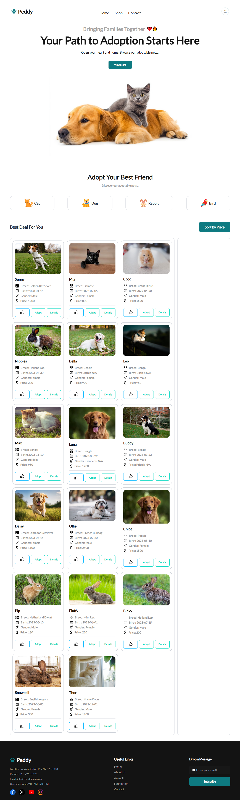

# 🚀 Peddy | Pet Adoption Platform

[](https://peddy-pet-adoption.netlify.app/)


This repository contains the source code for "Peddy," a responsive pet adoption platform. This project was developed as part of the Programming Hero Web Development Course, showcasing skills in modern front-end technologies.

## 🌐 Live Preview
🔗 **[https://peddypetadoption01.netlify.app/](https://peddypetadoption01.netlify.app/)**

## 🖼️ Screenshot
A preview of the deployed project:


## 📌 About This Project
Peddy is a single-page web application designed to help users find and adopt pets. The platform features a clean, user-friendly interface that allows users to browse available pets, view details, and simulate an adoption process. The project is fully responsive and designed with a mobile-first approach to ensure a seamless experience on all devices.

## 🎯 Key Features
- **Dynamic Pet Listings:** Fetches and displays a list of adoptable pets from a data source.
- **Category Filtering:** Allows users to filter pets by category.
- **Price Sorting:** Users can sort the pet listings by price.
- **Interactive Modals:** Provides detailed pet information and an adoption form in modals.
- **Responsive Design:** A fully responsive layout that works on mobile, tablet, and desktop screens.

## 🛠️ Technologies Used
| Technology | Purpose |
|------------|---------|
| **HTML5** | For semantic content structure. |
| **Tailwind CSS** | For utility-first styling and rapid UI development. |
| **DaisyUI** | A component library for Tailwind CSS to build UI elements. |
| **JavaScript** | For dynamic content, interactivity, and DOM manipulation. |
| **Font Awesome** | For icons used throughout the application. |
| **Netlify** | For continuous deployment and hosting. |

## 📂 Project Structure
Here is an overview of the file structure:
```
B10-Assignment-06/
├── images/
│   ├── ... (various project images)
├── js/
│   └── main.js
├── styles/
│   └── style.css
├── index.html
├── tailwind.config.js
└── README.md
```

## 🚀 How To Get Started
To explore this project on your local machine, follow these steps:

1. **Clone the repository:**
   ```bash
   git clone https://github.com/alamin247khan/B10-Assignment-6.git
   ```
2. **Navigate to the project directory:**
   ```bash
   cd B10-Assignment-6
   ```
3. **Open `index.html` in your web browser.**

No special build steps or installations are required to run this project.

## 🙏 Acknowledgements
A special thank you to the entire [Programming Hero](https://web.programming-hero.com/) team for their guidance and support throughout this learning journey.
